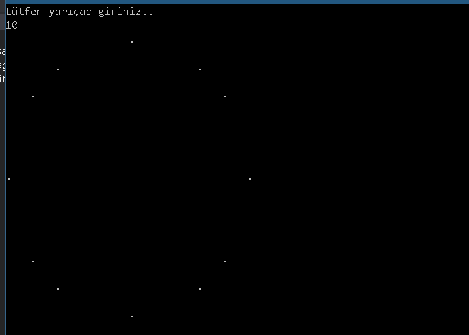

# Konsolda Daire Çizme

2 nokta arasındaki uzaklık formulü kullanılabilir.

   

Çemberin merkezinden çemberin üzerindeki bir noktanın uzaklığı yarıçap kadar olmalıdır. For döngüsüyle x ve y eksenlerini çap kadar gezilip nokta arasındaki uzaklık kontrol edilir.
   